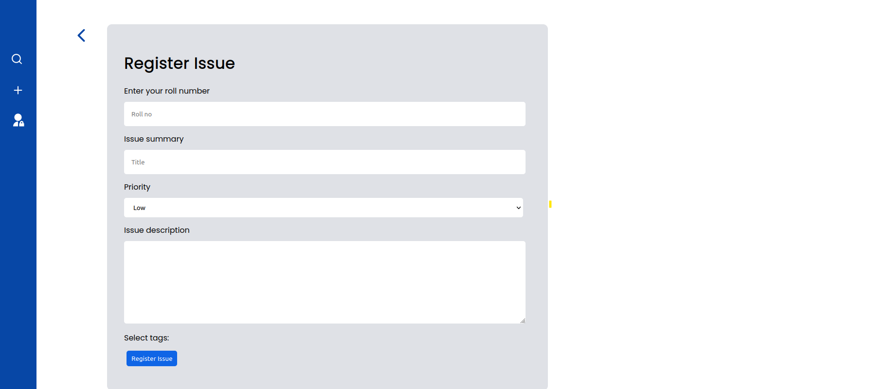

# Virtual Complaint Box

## Statement

Web Application for a hassle-free registration of hostel related complaints.
## Description

The problem is to provide a platform for students to register complaints in an open and intuitive manner.  
Our solution is a React-Flask web application that allows students to register complaints in just 2 clicks and track its status as updated by administrators.

Our web application's user interface is simple and easy to use, making filing a complaint a whole lot easier and rather fun. We chose a minimalistic and transparent approach in which users do not need to sign up to file complaints and can view all of the complaints that have been filed. Users can select one of a few predefined tags to which they believe their complaint may fall. They can also choose priority values (high, medium, low). Any complaint can be upvoted by users. This feature reduces redundancy, and complaints with more votes are prioritised. The complaints are classified into three types based on their status: open, assigned, and closed. They are further classified and sorted based on priority, votes, and date. The homepage lists all of the tags. Users can view complaints associated with a specific tag by clicking on them. Admins can assign the complaint to another admin, who will then be responsible for determining when the problem will be resolved and changing the status from open to assigned, and finally closed.

## Instructions

### Postgres Database

1. Create and set up a postgres database named `complaints`

    ```console
    $   createdb complaints
    $   psql -d complaints -a -f db.sql

### Python Backend

1. Create and activate a virtual environment in [path]

    ```console
    $   python3 -m venv [path]
    $   source [path]/bin/activate
    ```

2. Install the dependencies

   ```console
   $    pip install -r requirements.txt
   ```

3. Start the flask server

   ```console
   $    python app.py
   ```

### React Frontend

1. Install the dependencies

    ```console
    $   npm install
    ```

2. Start the react server

    ```console
    $   npm start
    ```

## Screenshots




1. What is the purpose of this project?  
   To provide a hassle-free way for students to register hostel related complaints.
2. What do the colors on the tiles mean?  
   The colors indicate the severity of the complaint. Green indicates a minor complaint, orange indicates a major complaint, and red indicates a critical complaint.
3. How are the tiles sorted?  
   The tiles are sorted in decreasing order of the severity of the complaint,  the number of votes on the complaint and the "freshness".
4. Can Admins alter the complaints?  
   No admins can only change the status, priority, assignee and eta.  

## Next Steps

1. Make the UI responsive.
2. Implement a mobile-optimized UI.
3. Implement a comments system on complaints.
4. Implement auto deletion of closed issues.
